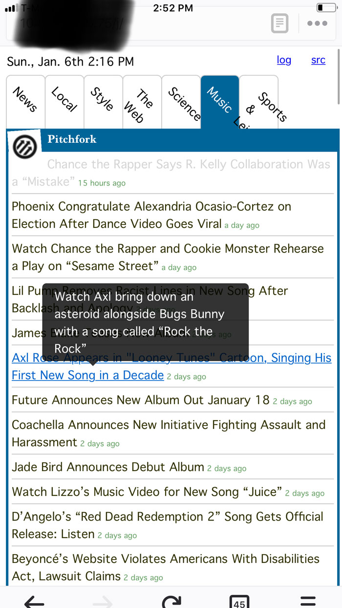

# jrss: A Python-based feed reader
## A modern reader in the spirit of classic web services like My Yahoo! and iGoogle, _jrss_ provides a snappy, useful reading experience in a single html file.
### v. 0.1.2

This is a project to build a portal-style feed reader. There are many viewers for keeping up on feeds in the spirit of Google Reader, but I have never been able to fully replace the casual viewing style of My Yahoo! circa 2004. I use this as a method of looking at headlines on my phone.

This program generates a static page that supports user-defined feeds in categories.



### Features

Jrss includes some useful features like:

* snappy navigation;
* tooltips that display on hover or thumb-press (probably; depending on device and browser);
* activity log;
* reasonable privacy maximization;
* minimal bandwidth demands in browser, on server, and for the feed hosts.

### Set up:

This is envisioned as something to run on a webserver; however, it will function perfectly well on a local machine as well. In either case, download the repo or clone from `git`.

This is Python 3 script only.

There are a bunch of required python modules; they are listed in the requirements.txt file. You can use the requirements file like so:

```$ pip install -r requirements.txt```

The program will optionally use a duckduckgo module available [here](https://github.com/jeffgerhard/duckduckgo-python3), but you can't install this from `pip`.

The repo includes a demo `feeds/feeds-demo.csv` file that has some sample RSS feeds in it. Rename or copy this file as `feeds/feeds.csv` and you can edit it by adding whatever other feeds you want. There are four columns in this csv: feed name, feed category, feed url, and (not-yet-implemented) feed filter.

The feeds are parsed and entries are saved in a sqlite database, and an index.html file is generated, suitable for moving and deploying on a server wherever you might like it. The program attempts to find and include favicons for the feeds (this is where that DuckDuckGo module might help for those that are hard to find).

_This is a beta version_ and needs a lot of code cleanup! But simply run the `jpage.py` after all is set up.

### Running as cron job, etc.

For my personal use case, I set up a bash script on a linux server that runs the Python program, then copies the resulting html file and logs over to a public web directory. It looks basically like this:

```
#!/bin/bash
python /srv/repos/jrss/jpage.py
cp /srv/repos/jrss/index.html /var/www/html/
cp -r /srv/repos/jrss/logs /var/www/html/
```

Make sure to `chmod` this script (per [these instructions](https://askubuntu.com/questions/350861/how-to-set-a-cron-job-to-run-a-shell-script)) and make sure that your root python instance has all the required packages installed.

You can then run this script in a cron job on whatever regular basis you want. Don't spam the feed hosts by running this every minute.

### Future features

This is not entirely finished. Future features include:

* Widgets (I have several ideas for added features outside the scope of simple feed reading)
* Feed filters
* CSS adjustments and cleanup
* Better management utilities, like:
    * user-initiated database rebuild
    * re-sorting of feeds
    * per-feed limits on dates displayed or number of entries to show
* Intelligent management of deprecated and error-riddle feeds; assessment of feed frequency
* Setting up a virtual environment and/or bundling into a standalone application

### Problems and bugs

Some things that I will fix in the future:

* TIME ZONES: in this early version, I have hard-coded the time zones based on my location (U.S. Eastern time) and my server's location.
* Logging: this saves presumably useless logs in perpetuity.
* CSS layout will break if you have many categories (this depends on your screen size and other factors).

### Credits

* The CSS tab layout is borrowed almost verbatim from [this demo by Louis Lazaris](https://www.adobe.com/devnet/archive/html5/articles/using-form-elements-and-css3-to-replace-javascript.html).
* CSS tooltips via [this tutorial by Keenan Payne](http://www.webdesignerdepot.com/2012/11/how-to-create-a-simple-css3-tooltip).
